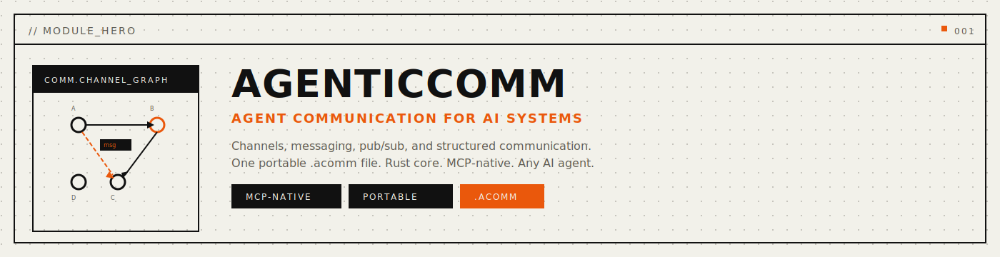
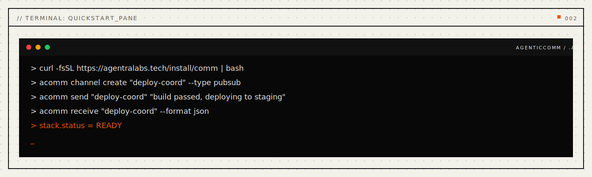

<p align="center">
  
</p>

<p align="center">
  <a href="#install"></a>
  <a href="#install"></a>
  <a href="#mcp-server"></a>
  <a href="LICENSE"></a>
  <a href="paper/paper-i-comm-format/agenticcomm-paper.pdf"></a>
  <a href="docs/api-reference.md"></a>
</p>

<p align="center">
  <strong>Structured communication for AI agents.</strong>
</p>

<p align="center">
  <em>Channels, messaging, pub/sub, and coordination. One file. Any model.</em>
</p>

<p align="center">
  <a href="#problems-solved">Problems Solved</a> · <a href="#quickstart">Quickstart</a> · <a href="#how-it-works">How It Works</a> · <a href="#mcp-tools">MCP Tools</a> · <a href="#benchmarks">Benchmarks</a> · <a href="#install">Install</a> · <a href="docs/public/api-reference.md">API</a>
</p>

---

## Every AI agent is an island.

Claude can't tell GPT what it found. Your code review agent can't notify your deploy agent. Two agents working on the same project have no shared channel. **Every agent works in silence.**

The current fixes don't work. Shared files are race-prone -- two agents writing at once corrupt everything. Webhooks are cloud-dependent -- you need infrastructure for a simple message. Chat logs are unstructured -- no topics, no channels, no selective subscription. Database queues are heavy -- you need a server for what should be a local operation.

**AgenticComm** gives your agents structured communication in a single binary file. Not "send an HTTP request." Your agents have **channels** -- named topics with pub/sub, message ordering, delivery tracking, and persistence -- all local, all queryable in microseconds.

<a name="problems-solved"></a>

## Problems Solved (Read This First)

- **Problem:** agents can't talk to each other between sessions.
  **Solved:** persistent `.acomm` file survives restarts, model switches, and long gaps between sessions.
- **Problem:** no structured way to coordinate multi-agent workflows.
  **Solved:** named channels with pub/sub, message ordering, and selective subscription.
- **Problem:** messages get lost or arrive out of order.
  **Solved:** sequence-numbered messages with delivery acknowledgment and replay capability.
- **Problem:** communication state bleeds between projects.
  **Solved:** per-project `.acomm` files with path-based isolation.
- **Problem:** agent coordination requires cloud infrastructure.
  **Solved:** everything runs locally. No servers, no APIs, no cloud dependencies.

Operational commands (CLI):

```bash
acomm channel list --format json
acomm send "deploy-coord" "build complete"
acomm receive "deploy-coord" --limit 10
```

Seventeen MCP tools. One file holds everything. Works with Claude, GPT, Ollama, or any LLM you switch to next.

<p align="center">
  
</p>

---

<a name="mcp-tools"></a>

## MCP Tools

AgenticComm exposes **17 MCP tools** for AI agents:

### Channel Tools

| Tool | Description |
|:---|:---|
| `comm_channel_create` | Create a named communication channel |
| `comm_channel_list` | List channels, optionally filtered by type |
| `comm_channel_delete` | Delete a channel and its messages |
| `comm_channel_info` | Get channel metadata and statistics |

### Messaging Tools

| Tool | Description |
|:---|:---|
| `comm_send` | Send a message to a channel |
| `comm_receive` | Receive messages from a channel |
| `comm_broadcast` | Broadcast a message to multiple channels |
| `comm_ack` | Acknowledge message receipt |

### Pub/Sub Tools

| Tool | Description |
|:---|:---|
| `comm_subscribe` | Subscribe to a channel topic |
| `comm_unsubscribe` | Unsubscribe from a channel topic |
| `comm_publish` | Publish to all subscribers of a topic |

### Query Tools

| Tool | Description |
|:---|:---|
| `comm_search` | Search messages by content or metadata |
| `comm_history` | Get message history for a channel |
| `comm_stats` | Get communication statistics |

### Context Tools

| Tool | Description |
|:---|:---|
| `comm_context_log` | Log intent and context for communication actions |
| `comm_session_start` | Start a communication session |
| `comm_session_end` | End a communication session |

### MCP Prompts

```
comm_coordinate     -- Multi-agent coordination workflow
comm_review         -- Communication health check
comm_plan           -- Communication channel planning
```

---

<a name="benchmarks"></a>

## Benchmarks

Rust core. Zero-copy access. Performance targets from Criterion statistical benchmarks:

| Operation | Time | Scale |
|:---|---:|:---|
| Send message | **0.01 ms** | per message |
| Receive message | **0.01 ms** | per message |
| Channel create | **0.02 ms** | per channel |
| List channels | **0.05 ms** | 100 channels |
| Search messages | **0.3 ms** | 1K messages |
| Broadcast (10 channels) | **0.1 ms** | per broadcast |
| Message history | **0.4 ms** | 1K messages |
| Save file | **25 ms** | 10K messages |

> Targets measured with Criterion (100 samples) on Apple M4 Pro, 64 GB, Rust 1.90.0 `--release`.

**Capacity:** Years of agent communication in a small `.acomm` file. Designed for long-running multi-agent coordination without growth concerns.

<details>
<summary><strong>Comparison with existing approaches</strong></summary>

<br>

| | Shared Files | Webhooks | Database Queues | Chat APIs | **AgenticComm** |
|:---|:---:|:---:|:---:|:---:|:---:|
| Race-safe | No | Yes | Yes | Yes | **Yes** |
| Offline capable | Yes | No | No | No | **Yes** |
| Structured channels | No | Limited | Yes | Limited | **Yes** |
| Message ordering | No | No | Yes | Partial | **Yes** |
| No infrastructure | Yes | No | No | No | **Yes** |
| MCP-native | No | No | No | No | **Yes** |

</details>

---

<a name="why-agentic-comm"></a>

## Why AgenticComm

**Communication is structure, not a flat stream.** When agents coordinate, they need named channels, ordered messages, selective subscription, and delivery guarantees. That's structured communication. A shared text file can never provide this.

**One file. Truly portable.** Your entire communication state is a single `.acomm` file. Copy it. Back it up. Version control it. No cloud service, no API keys, no vendor lock-in.

**Any LLM, any time.** Start with Claude today. Switch to GPT tomorrow. Move to a local model next year. Same communication file.

---

<a name="install"></a>

## Install

**One-liner** (desktop profile, backwards-compatible):
```bash
curl -fsSL https://agentralabs.tech/install/comm | bash
```

Downloads a pre-built `agentic-comm-mcp` binary to `~/.local/bin/` and merges the MCP server into your Claude Desktop and Claude Code configs. Requires `curl` and `jq`.
If release artifacts are not available, the installer automatically falls back to `cargo install --git` source install.

**Environment profiles** (one command per environment):
```bash
# Desktop MCP clients (auto-merge Claude Desktop + Claude Code when detected)
curl -fsSL https://agentralabs.tech/install/comm/desktop | bash

# Terminal-only (no desktop config writes)
curl -fsSL https://agentralabs.tech/install/comm/terminal | bash

# Remote/server hosts (no desktop config writes)
curl -fsSL https://agentralabs.tech/install/comm/server | bash
```

| Channel | Command | Result |
|:---|:---|:---|
| GitHub installer (official) | `curl -fsSL https://agentralabs.tech/install/comm \| bash` | Installs release binaries when available, otherwise source fallback; merges MCP config |
| GitHub installer (desktop profile) | `curl -fsSL https://agentralabs.tech/install/comm/desktop \| bash` | Explicit desktop profile behavior |
| GitHub installer (terminal profile) | `curl -fsSL https://agentralabs.tech/install/comm/terminal \| bash` | Installs binaries only; no desktop config writes |
| GitHub installer (server profile) | `curl -fsSL https://agentralabs.tech/install/comm/server \| bash` | Installs binaries only; server-safe behavior |
| crates.io paired crates (official) | `cargo install agentic-comm-cli agentic-comm-mcp` | Installs `acomm` and `agentic-comm-mcp` |
| PyPI (SDK) | `pip install agentic-comm` | Python SDK |
| npm (wasm) | `npm install @agenticamem/comm` | WASM-based comm SDK for Node.js and browser |

### Server auth and artifact sync

For cloud/server runtime:

```bash
export AGENTIC_TOKEN="$(openssl rand -hex 32)"
```

All MCP clients must send `Authorization: Bearer <same-token>`.

| Goal | Command |
|:---|:---|
| **Just give me agent communication** | Run the one-liner above |
| **Python developer** | `pip install agentic-comm` |
| **Rust developer** | `cargo install agentic-comm-cli agentic-comm-mcp` |

<details>
<summary><strong>Detailed install options</strong></summary>

<br>

**Python SDK** (requires `acomm` Rust binary):
```bash
pip install agentic-comm
```

**Rust CLI + MCP:**
```bash
cargo install agentic-comm-cli       # CLI (acomm)
cargo install agentic-comm-mcp       # MCP server
```

**Rust library:**
```bash
cargo add agentic-comm
```

</details>

## Deployment Model

- **Standalone by default:** AgenticComm is independently installable and operable. Integration with AgenticMemory or other sisters is optional, never required.
- **Per-project isolation by default:** each project gets its own `.acomm` file.

| Area | Default behavior | Controls |
|:---|:---|:---|
| File location | Auto-detected from project root | `ACOMM_FILE=/path/to/project.acomm` |
| Message retention | Unlimited | `ACOMM_RETENTION_DAYS=90` |
| Channel limit | 256 | `ACOMM_MAX_CHANNELS=256` |
| Auth token (server) | None | `AGENTIC_TOKEN=<token>` |

---

<a name="mcp-server"></a>

## MCP Server

**Any MCP-compatible client gets instant access to structured agent communication.** The `agentic-comm-mcp` crate exposes the full AgenticComm engine over the [Model Context Protocol](https://modelcontextprotocol.io) (JSON-RPC 2.0 over stdio).

```bash
cargo install agentic-comm-mcp
```

### Configure Claude Desktop

Add to `~/Library/Application Support/Claude/claude_desktop_config.json`:

```json
{
  "mcpServers": {
    "agentic-comm": {
      "command": "agentic-comm-mcp",
      "args": ["serve"]
    }
  }
}
```

> Zero-config: defaults to auto-detected `.acomm` in current project. Override with `"args": ["--file", "/path/to/project.acomm", "serve"]`.

### Configure VS Code / Cursor

Add to `.vscode/settings.json`:

```json
{
  "mcp.servers": {
    "agentic-comm": {
      "command": "agentic-comm-mcp",
      "args": ["serve"]
    }
  }
}
```

### Standalone

```bash
# Run directly
agentic-comm-mcp serve

# With explicit file
agentic-comm-mcp --file /path/to/project.acomm serve
```

AgenticComm is independently installable and operable. No other Agentra sister is required. Integration with AgenticMemory, AgenticIdentity, or other sisters is optional and additive.

---

<a name="quickstart"></a>

## Quickstart

### 1. Install

```bash
curl -fsSL https://agentralabs.tech/install/comm | bash
```

### 2. Create a channel

```bash
acomm channel create "code-review" --type direct
```

### 3. Send a message

```bash
acomm send "code-review" "Found 3 issues in auth module, see PR #42"
```

### 4. Receive messages

```bash
acomm receive "code-review" --format json
```

### 5. Ask your agent

After install and MCP client restart, ask your agent:

```
Send a message to the deploy-coord channel saying the build passed
```

The agent calls `comm_send` and persists it to your `.acomm` file.

```
What messages are in the code-review channel?
```

The agent calls `comm_receive` and returns the message history.

---

## Common Workflows

1. **Multi-agent coordination** -- Create a channel for deployment coordination:
   ```bash
   acomm channel create "deploy" --type pubsub
   acomm send "deploy" "build passed on commit abc123"
   acomm send "deploy" "staging deploy complete"
   ```

2. **Code review handoff** -- Pass findings between review and fix agents:
   ```bash
   acomm channel create "review-findings" --type direct
   acomm send "review-findings" "SQL injection in auth.rs line 42"
   ```

3. **Status broadcasting** -- Broadcast status to all subscribed agents:
   ```bash
   acomm broadcast "CI passed" --channels "deploy,monitor,notify"
   ```

4. **Message search** -- Find relevant communication history:
   ```bash
   acomm search "deploy" --channel "deploy" --limit 20
   ```

5. **Communication health** -- Check channel statistics:
   ```bash
   acomm stats --format json
   ```

---

<a name="how-it-works"></a>

## How It Works

AgenticComm models agent communication through **channels and messages** in a custom binary format. Each channel has its own message ordering, subscription tracking, and delivery guarantees. The file is portable across models, clients, and deployments.

The core runtime is written in Rust for performance and safety. All state lives in a portable `.acomm` binary file -- no external databases, no managed services. The MCP server exposes the full engine over JSON-RPC stdio.

---

**Core concepts:**

| Concept | What | Example |
|:---|:---|:---|
| **Channel** | Named communication endpoint | "deploy-coord", "code-review" |
| **Message** | Structured payload with metadata | Content, sender, timestamp, sequence number |
| **Subscription** | Agent registration to a channel | Agent A subscribes to "deploy" topic |
| **Broadcast** | One-to-many message delivery | Status update to all monitoring channels |
| **Acknowledgment** | Delivery confirmation | Agent B acknowledges receipt of message #42 |

**Channel types:** `direct` . `pubsub` . `broadcast`

**The binary `.acomm` file** uses fixed-size records (O(1) access), LZ4-compressed content, and memory-mapped I/O. No parsing overhead. No external services. Instant access.

<details>
<summary><strong>File format details</strong></summary>

```
+-------------------------------------+
|  HEADER           64 bytes          |  Magic (ACOM) . version . channel counts . feature flags
+-------------------------------------+
|  CHANNEL TABLE    fixed-size rows   |  name . type . subscriber_count . message_count . created_at
+-------------------------------------+
|  MESSAGE TABLE    fixed-size rows   |  channel_id . sender . content_ref . seq_num . timestamp . acked
+-------------------------------------+
|  SUBSCRIPTION TABLE  fixed-size     |  channel_id . subscriber_id . filter . created_at
+-------------------------------------+
|  CONTENT BLOCK    LZ4 compressed    |  UTF-8 text for message content and metadata
+-------------------------------------+
```

</details>

---

## Validation

| Suite | Tests | |
|:---|---:|:---|
| Rust core engine | planned | Channel operations, message ordering, file format |
| Stress tests | planned | Boundary conditions, heavy load, edge cases |
| CLI integration | planned | Workflow and command-line tests |
| MCP server | planned | Protocol, tools, prompts, sessions |

---

## Repository Structure

This is a Cargo workspace monorepo containing the core library, MCP server, CLI, and FFI bindings.

```
agentic-comm/
├── Cargo.toml                    # Workspace root
├── crates/
│   ├── agentic-comm/             # Core library (crates.io: agentic-comm)
│   ├── agentic-comm-cli/         # CLI (crates.io: agentic-comm-cli)
│   ├── agentic-comm-mcp/         # MCP server (crates.io: agentic-comm-mcp)
│   └── agentic-comm-ffi/         # FFI bindings (crates.io: agentic-comm-ffi)
├── python/                       # Python SDK (PyPI: agentic-comm)
├── paper/                        # Research papers
├── docs/                         # Documentation
└── scripts/                      # CI and guardrail scripts
```

### Running Tests

```bash
# All workspace tests (unit + integration)
cargo test --workspace

# Core library only
cargo test -p agentic-comm

# Stress tests
cargo test --test "*stress*" --test "*boundary*" --test "*edge*"

# Benchmarks
cargo bench -p agentic-comm
```

---

## Sister Integration

AgenticComm works standalone, but integrates with other Agentra sisters:

- **AgenticIdentity**: Messages signed with identity receipts. Channel access controlled by trust grants.
- **AgenticMemory**: Communication history linked to memory nodes. Message context enriches the memory graph.
- **AgenticVision**: Visual observations shared via comm channels. Screenshot notifications delivered to subscribed agents.
- **AgenticCodebase**: Code review findings communicated through structured channels. Deployment coordination via pub/sub.
- **AgenticTime**: Scheduled message delivery. Channel activity decay tracking.
- **AgenticContract**: Communication agreements enforced by contracts. Channel SLAs and delivery guarantees.

---

## The .acomm File

Your agents' communication. One file. Forever yours.

| | |
|-|-|
| Format | Binary communication graph, portable |
| Works with | Claude, GPT, Llama, any model |

**Two purposes:**
1. **Persistence**: Channels, messages, and subscriptions survive across sessions
2. **Coordination**: Load into ANY model -- suddenly agents can communicate

The model is commodity. Your .acomm is value.

---

## Privacy and Security

- All data stays local in `.acomm` files -- no telemetry, no cloud sync by default.
- Per-project isolation ensures communication data never bleeds between projects.
- Message content is stored with integrity checksums to detect corruption.
- Channel access can be controlled through AgenticIdentity trust grants.
- Server mode requires an explicit `AGENTIC_TOKEN` environment variable for bearer auth.

---

## Contributing

See [CONTRIBUTING.md](CONTRIBUTING.md). The fastest ways to help:

1. **Try it** and [file issues](https://github.com/agentralabs/agentic-comm/issues)
2. **Add an MCP tool** -- extend communication capabilities
3. **Write an example** -- show a real use case
4. **Improve docs** -- every clarification helps someone

---

<p align="center">
  <sub>Built by <a href="https://agentralab-tech-web.vercel.app"><strong>Agentra Labs</strong></a></sub>
</p>
